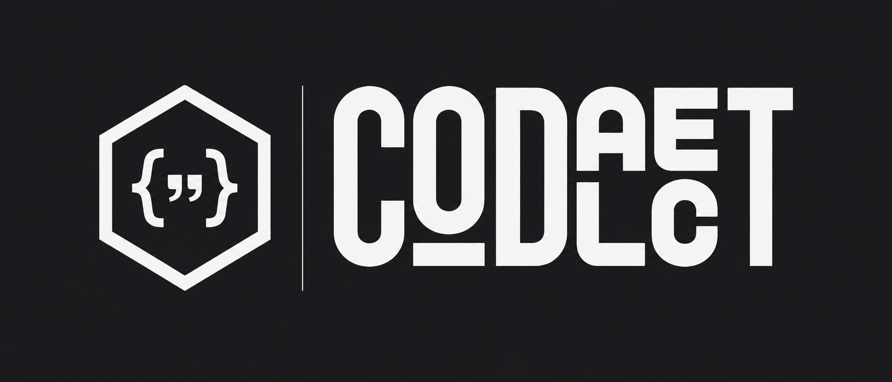
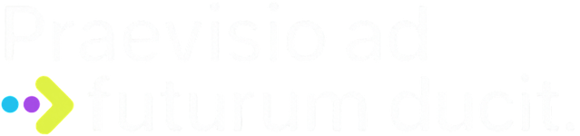

<br>

<div id="codalect-logo" align="center">
    <br>
    
    <h3>Codalect for Desktop</h3>
</div>

<div id="tagline" align="center">

Optimize judgment, not output.

</div>

## The Problem

AI coding tools have made developers more productive while making intermediate learners less capable. The pattern is consistent: a learner generates working code, has no clear idea why it works, and now has less incentive to find out. This is *de-skilling* — the erosion of durable competence when AI substitutes for the retrieval and reasoning that build it. Cursor, Copilot, and Codex are optimized for output velocity. For a learner, that optimization works against them.

## The Insight

**The constraint is the product.** An IDE that resists completing work the learner could reason through is not a worse IDE — it is a different product with a different purpose. The Socratic constraint layer, the cursor agent, and nerfed inline completions are each a direct expression of this thesis, not workarounds.

## Architecture

Codalect Desktop is built on [Eclipse Theia IDE](https://theia-ide.org/) v1.67.100 — an open-source, VS Code-compatible IDE framework with full Electron packaging. Theia's dependency injection model (InversifyJS) allows any framework service to be overridden at the binding layer without forking the underlying platform. This is the mechanism that makes the constraint layer non-invasive.

```
desktop/
├── applications/
│   └── electron/          Electron desktop app (primary target)
├── theia-extensions/
│   ├── product/           Branding — welcome page, about dialog, icons
│   └── codalect-ai/       Socratic constraint layer 
```

All Codalect-specific behavior lives in `theia-extensions/`. None of the `@theia/*` packages are forked or patched — every override is a `rebind()` call in a `ContainerModule`. This preserves the ability to track upstream Theia releases as the framework evolves.

## Key Decisions

**Theia as the backbone.** Theia provides the full VS Code-compatible IDE surface — Monaco editor, language server protocol, extension host, file system — without building any of it. The critical capability is the DI override model: any service in the framework can be replaced by registering a subclass at the same binding point. The constraint layer is exactly this: a custom `Agent` implementation registered over the default IDE chat agent.

**`rebind()` over fork.** The Socratic constraint layer overrides `@theia/ai-chat`'s agent. Nerfed completions override `@theia/ai-code-completion`'s provider. The cursor agent adds an overlay widget to Monaco. None of these require touching framework source code.

**Claude via `@theia/ai-anthropic`.** Theia ships the AI infrastructure — `@theia/ai-core`, `@theia/ai-chat`, `@theia/ai-anthropic`. The constraint layer is a custom agent that uses these contribution points, not a standalone AI integration built from scratch.

**Monaco overlay widgets for the cursor agent.** `monaco.editor.ICodeEditor.addOverlayWidget()` renders contextual UI near the cursor without intercepting keyboard input or disrupting flow. No equivalent surface exists in Cursor or Copilot. This is a novel interaction primitive.

## Build

**Requirements:** Node.js ≥ 20, Yarn 1.x (`>=1.7.0 <2`)

```bash
# Dev build (faster, unminified frontend)
yarn && yarn build:dev && yarn download:plugins

# Run browser app
yarn browser start                  # localhost:3000

# Run Electron app
yarn electron start

# Package Electron app (outputs to applications/electron/dist/)
yarn electron package

# Clean build (after pulling or changing deps)
git clean -xfd && yarn && yarn build:dev && yarn download:plugins
```

## Repository

Built on [Eclipse Theia IDE](https://github.com/eclipse-theia/theia-ide) v1.67.100 (MIT).

`v0.0.0` — unmodified upstream Theia fork  
`desktop-v*` — Codalect work

Codalect is a product of [Praevisio Labs](https://github.com/Praevisio-Labs).

<br>

<div id="praevisio-slogan" align="left">

  

</div>

<br>

## License

[MIT](LICENSE)
